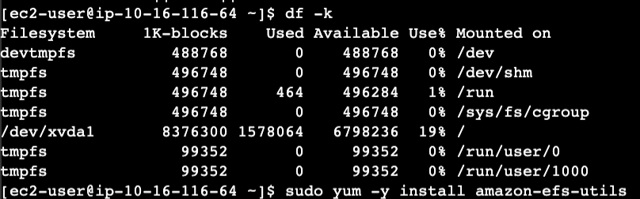

# Implementing EFS Demo


NETWORK SETTINGS

Best Practice
    Any availability zone within a VPC where you're consuming the services provided by EFS, you should be creating a mount target.


Instance A


    Shows that file system is not mounted

In linux, all file systems are mounted onto a folder.

## Create a folder

```bash
sudo mkdir -p /efs/wp-content
```

`-p` option means that everything in the path will be created if it is not already exist.

## Install package of tools 

Allows instance to interact with EFS product

```bash
sudo yum -y install amazon-efs-utils
```

## Mount everytime the instance is restarted 

```bash
cd /etc
```

```bash
sudo nano /etc/fstab
```

in next line of fstab

```bash
file-system-id:/ /efs/wp-content efs _netdev,tls,iam 0 0
```


file-system-id


### Mount filesystem

```bash
sudo mount /efs/wp-content
```


## Create file in filesystem

To demonstrate NFS


## Switch to Instance B



