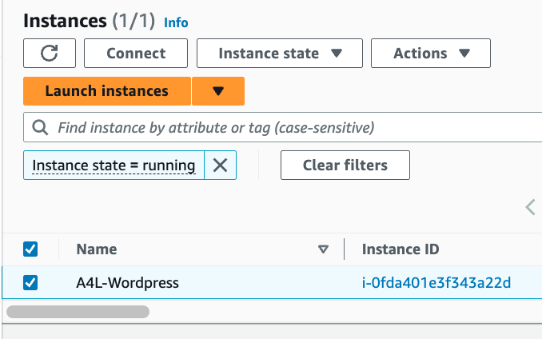
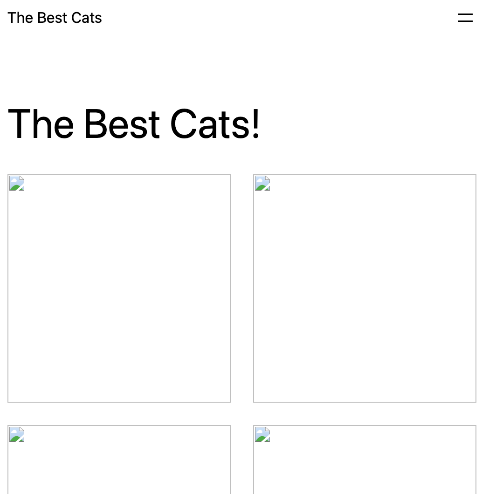
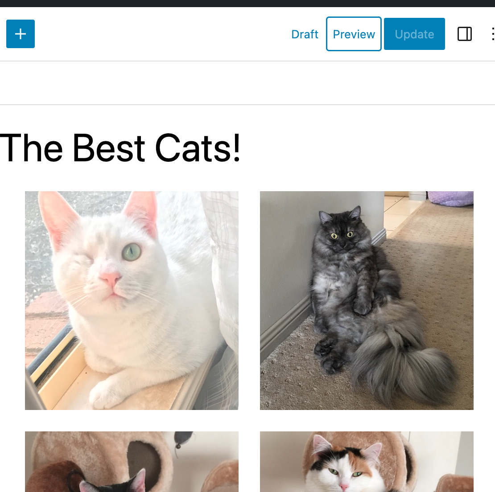
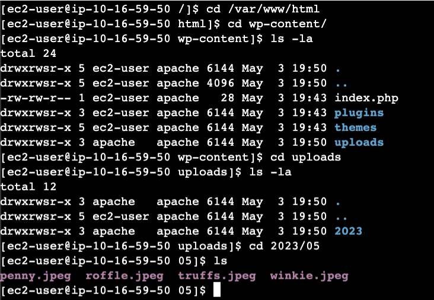
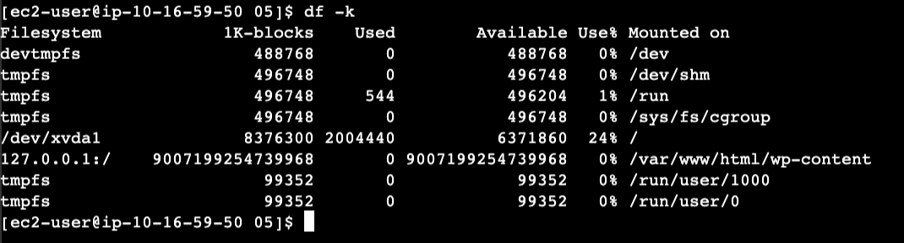
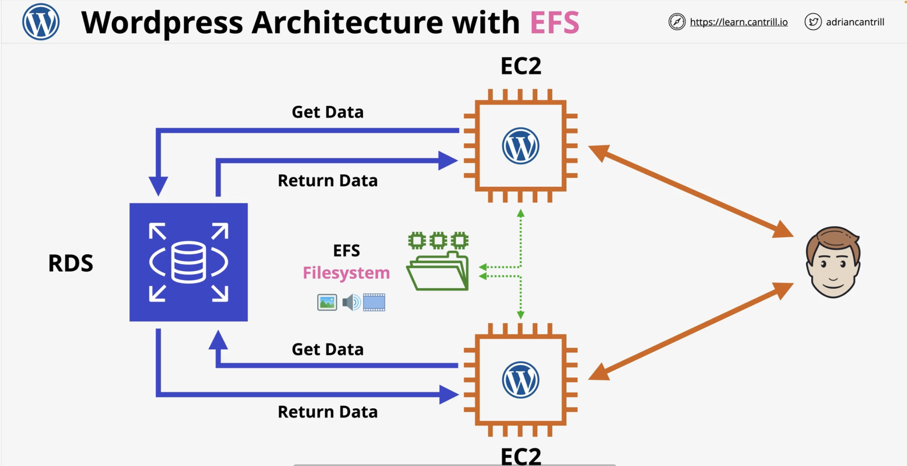

# Using EFS with Wordpress

Objective is to move wp-content from EC2 instance to EFS based filesystem

[First CF template](https://console.aws.amazon.com/cloudformation/home?region=us-east-1#/stacks/create/review?templateURL=https://learn-cantrill-labs.s3.amazonaws.com/awscoursedemos/0020-aws-associate-storage-scaling-wordpress-with-efs/A4L_VPC_EFS_AURORA.yaml&stackName=EFSDEMO-VPC-RDS-EFS)

Template needs DB snapshot: a4lwordpress-aurora-with-cat-post

[Create next stack](https://console.aws.amazon.com/cloudformation/home?region=us-east-1#/stacks/create/review?templateURL=https://learn-cantrill-labs.s3.amazonaws.com/awscoursedemos/0020-aws-associate-storage-scaling-wordpress-with-efs/A4L_WORDPRESS.yaml&stackName=EFSDEMO-WORDPRESS1)

Creates an EC2 instance with wordpress but images cannot be shown.

Manually update wordpress post. Use `instance ip`/wp-admin

Verification of uploads:

Shows EFS mounting:

[Last stack](https://console.aws.amazon.com/cloudformation/home?region=us-east-1#/stacks/create/review?templateURL=https://learn-cantrill-labs.s3.amazonaws.com/awscoursedemos/0020-aws-associate-storage-scaling-wordpress-with-efs/A4L_WORDPRESS.yaml&stackName=EFSDEMO-WORDPRESS2)

Delete wordpress stack 1

Check EC2 instance 2 for images

Recreate second CF template

Check EC2 instance 1 for images

Should show on both because of shared file system EFS.

Lesson Architecture

